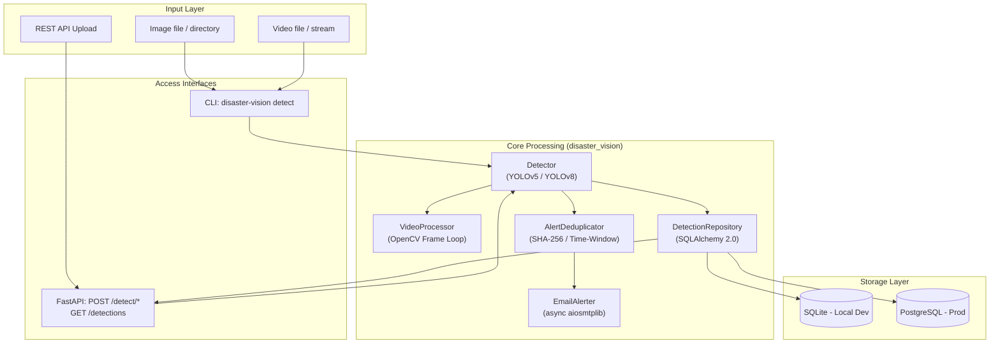

# Disaster Response Vision

> **End-to-end computer-vision pipeline** for detecting people and animals in disaster-zone imagery — built as a production-grade rebuild of a university prototype.

[](https://github.com/Lohithaswin/Life-detection-in-Disaster-zones/actions/workflows/ci.yml)
[](https://www.python.org/)
[](LICENSE)

---

## 📖 Table of Contents
1. [Project Overview & Motivation](#project-overview--motivation)
2. [Key Engineering Features](#key-engineering-features)
3. [System Architecture](#system-architecture)
4. [Component Deep Dive](#component-deep-dive)
5. [Project Structure](#project-structure)
6. [Quickstart Guides](#quickstart-guides)
7. [CLI Reference](#cli-reference)
8. [API Reference & Examples](#api-reference--examples)
9. [Configuration Guide](#configuration-guide)
10. [Benchmark & Metrics](#benchmark--metrics)
11. [Development & Testing](#development--testing)
12. [Limitations](#limitations)

---

## 🌍 Project Overview & Motivation

In the aftermath of natural disasters (earthquakes, floods, hurricanes), rapid detection of life is critical for search and rescue operations. Unmanned Aerial Vehicles (UAVs) and drones can capture vast amounts of aerial imagery and video, but manually reviewing this footage is time-consuming.

**Disaster Response Vision** is an automated pipeline designed to ingest images or video streams, detect signs of life (people and animals) using state-of-the-art YOLO object detection models, log the findings to a relational database, and immediately dispatch deduplicated email alerts to rescue coordinators.

Originally a university prototype ("TOC Project"), this repository represents a complete, professional rebuild focusing on **reliability, type-safety, testability, and deployment readiness**.

---

## 🚀 Key Engineering Features

| Feature | Implementation Details |
|---|---|
| **Unified Model Interface** | The `Detector` class abstracts the differences between YOLOv5 and YOLOv8. It infers the model family by filename and lazy-loads the PyTorch weights on the first inference call to save memory. |
| **Domain-Driven Design** | Detection results are parsed into frozen, type-hinted `Detection` and `BoundingBox` dataclasses, ensuring strong typing and serializability across the API and DB layers. |
| **Smart Alert Deduplication** | To prevent spamming coordinators during a continuous video feed, the `AlertDeduplicator` generates a SHA-256 hash of the detected classes and suppresses duplicate email alerts within a configurable time window (default 5 minutes). |
| **Asynchronous Emailing** | Alerts are dispatched using `aiosmtplib` as FastAPI `BackgroundTasks`, ensuring that the API response is not blocked while waiting for the SMTP server handshake. |
| **Dual Database Support** | Built on SQLAlchemy 2.0. Defaults to SQLite for frictionless local development, but seamlessly swaps to PostgreSQL for production deployments via the `DATABASE_URL` environment variable. |
| **Alembic Migrations** | Database schema evolution is managed via Alembic. The `001_initial_schema` migration creates the `media_records` and `detection_records` tables with proper foreign keys and indices. |
| **Containerized Deployment** | A highly optimized `Dockerfile` and `docker-compose.yml` allow for one-command deployment of the API and PostgreSQL database, complete with volume persistence and health checks. |

---

## 🏗️ System Architecture

The system is decoupled into discrete layers: Input interfaces (CLI/API), the Core Processing engine, and the Storage/Alerting integrations.



---

## 🔍 Component Deep Dive

### 1. Object Detection (`src/disaster_vision/detection/`)
Powered by Ultralytics, the pipeline filters down the 80 COCO classes to only **11 life-sign classes** (person, bird, cat, dog, horse, sheep, cow, elephant, bear, zebra, giraffe). The `VideoProcessor` uses OpenCV (`cv2.VideoCapture`) to iterate through video frames, running inference on each frame and aggregating the results without requiring the entire video to fit into RAM.

### 2. Alerting Engine (`src/disaster_vision/alerts/`)
When a life-sign is detected, an `AlertPayload` is constructed. The `AlertDeduplicator` creates a unique key based on the detected classes and the source name. If an alert with that key was sent within the `ALERT_DEDUP_SECONDS` window, the new alert is silently dropped to prevent inbox flooding. If it passes, `EmailAlerter` formats a MIME multipart email and dispatches it via TLS.

### 3. Data Persistence (`src/disaster_vision/db/`)
The `DetectionRepository` acts as a Unit of Work. When media is processed, it first creates a `MediaRecord` (storing the filename and timestamp). It then bulk-inserts `DetectionRecord`s (storing bounding box coordinates, confidence scores, and class names) linked via a foreign key.

---

## 📂 Project Structure

```
disaster-response-vision/
├── src/disaster_vision/
│   ├── config.py               # Settings management via pydantic-settings
│   ├── logging_config.py       # Standardized structured logging
│   ├── cli.py                  # Typer CLI application
│   ├── legacy_menu.py          # Preserved interactive terminal menu
│   ├── detection/
│   │   ├── detector.py         # YOLO abstraction & Data Models
│   │   └── video.py            # OpenCV video stream processing
│   ├── alerts/
│   │   ├── dedup.py            # Rate-limiting and deduplication logic
│   │   └── email_alert.py      # SMTP dispatch and payload formatting
│   ├── db/
│   │   ├── models.py           # SQLAlchemy declarative base and tables
│   │   └── repository.py       # CRUD operations and session management
│   ├── api/
│   │   ├── main.py             # FastAPI routing and lifecycle hooks
│   │   └── schemas.py          # Pydantic v2 validation models
│   └── evaluation/
│       └── benchmark.py        # Automated COCO128 mAP and latency benchmarking
├── tests/                      # Pytest suite with mocked dependencies
├── alembic/                    # Database migration scripts
├── scripts/                    # Utilities for fetching weights and sample data
├── .github/workflows/ci.yml    # CI/CD pipeline (Lint, Type-check, Test)
├── Dockerfile                  # Multi-stage container build
├── docker-compose.yml          # Local cluster orchestration
├── pyproject.toml              # PEP-517 metadata and tool configuration
└── .env.example                # Environment variable template
```

---

## ⚡ Quickstart Guides

### Option A: Docker Compose (Production-Ready)
The fastest way to run the full stack, including PostgreSQL.

```bash
git clone https://github.com/Lohithaswin/Life-detection-in-Disaster-zones.git
cd disaster-response-vision

# Set up environment variables (add SMTP details if you want emails)
cp .env.example .env

# Build and spin up the API and Database
docker compose up --build
```
* **API Documentation:** `http://localhost:8000/docs`
* **Health Check:** `http://localhost:8000/health`

### Option B: Local Python Environment (Development)
Ideal for modifying code, running the CLI, or executing tests. Requires Python 3.10+.

```bash
cd disaster-response-vision

# 1. Create and activate a virtual environment
python -m venv .venv
# Windows:
.venv\Scripts\activate
# macOS/Linux:
source .venv/bin/activate

# 2. Install the package in editable mode with development dependencies
pip install -e ".[dev]"

# 3. Setup configuration and download required assets
cp .env.example .env
python scripts/download_weights.py          # Fetches yolov8n.pt and yolov5s.pt
python scripts/download_sample_data.py      # Downloads CC-licensed test images

# 4. Initialize the SQLite database
alembic upgrade head

# 5. Start the API server
disaster-vision-api
```

---

## 💻 CLI Reference

The `disaster-vision` CLI provides direct access to the pipeline without needing the HTTP server.

| Command | Description |
|---------|-------------|
| `disaster-vision detect <path>` | Run inference on a file or recursively on a directory. |
| `disaster-vision alert-test` | Send a test email to verify SMTP configuration. |
| `disaster-vision legacy-menu` | Launch the original interactive terminal menu. |

**Detection Flags:**
* `--model <name>`: Specify weights (default: `yolov8n`).
* `--life-only`: Ignore non-life classes (e.g., cars, chairs).
* `--no-alert`: Disable email dispatch.
* `--no-db`: Disable database persistence.

**Examples:**
```bash
# Process a single video using YOLOv5, persisting to DB but sending no emails
disaster-vision detect data/samples/drone_feed.mp4 --model yolov5s --no-alert

# Process a folder of images, alerting only on people/animals
disaster-vision detect data/samples/ --life-only
```

---

## 🌐 API Reference & Examples

The FastAPI service exposes the pipeline over HTTP.

### Endpoints

| Method | Endpoint | Description |
|--------|----------|-------------|
| `GET` | `/health` | API Liveness probe. |
| `GET` | `/detections?limit=100` | Fetch the most recent detection records from the database. |
| `POST` | `/detect/image` | Upload an image for immediate inference. |
| `POST` | `/detect/video` | Upload a video for frame-by-frame inference. |

### Python Request Example (`POST /detect/image`)

```python
import requests

url = "http://localhost:8000/detect/image"
files = {"file": ("rubble.jpg", open("rubble.jpg", "rb"), "image/jpeg")}
data = {
    "model": "yolov8n",
    "life_only": True,
    "send_alert": True,
    "persist": True
}

response = requests.post(url, files=files, data=data)
print(response.json())
```

**Example JSON Response:**
```json
{
  "status": "success",
  "media_name": "rubble.jpg",
  "life_detected": true,
  "detections": [
    {
      "class_name": "person",
      "confidence": 0.89,
      "bbox": {"x1": 120.5, "y1": 45.0, "x2": 200.1, "y2": 150.8}
    }
  ]
}
```

---

## ⚙️ Configuration Guide

The pipeline is entirely driven by environment variables, managed via `pydantic-settings`. 

| Variable | Default | Description |
|----------|---------|-------------|
| `DEFAULT_MODEL` | `yolov8n` | Fallback model if none is specified. |
| `CONFIDENCE_THRESHOLD` | `0.25` | Minimum confidence score to register a detection. |
| `DATABASE_URL` | `sqlite:///./data/disaster_vision.db` | Connection string. Change to `postgresql+psycopg2://...` for production. |
| `SMTP_HOST` | `smtp.gmail.com` | SMTP server address. |
| `SMTP_PORT` | `587` | SMTP server port (TLS). |
| `SMTP_USER` | `""` | Email account used for authentication. |
| `SMTP_PASSWORD`| `""` | **App Password** for the email account (do not use your real password). |
| `ALERT_TO` | `""` | The destination email address for rescue alerts. |
| `ALERT_DEDUP_SECONDS`| `300` | Time in seconds to suppress identical alerts (default: 5 mins). |

> **Gmail App Password Note:** To use Gmail for sending alerts, you must enable 2-Step Verification on your Google account and generate an "App Password". Use this 16-character string as the `SMTP_PASSWORD`.

---

## 📊 Benchmark & Metrics

We provide a reproducible benchmark script to evaluate model accuracy (mAP) and inference latency on your specific hardware. 

- **Dataset:** Ultralytics `coco_val_subset.yaml` — 300 images strictly sampled from the MS COCO val2017 split.
- **Methodology:** `model.val()` is evaluated on this **genuinely held-out validation split** to measure true generalization. There is no overlap with the images the YOLO models saw during pre-training, avoiding the optimistic bias (data leakage) that occurs when evaluating against `coco128`.
- **License:** [CC BY 4.0](https://creativecommons.org/licenses/by/4.0/)
- **Output:** `evaluation/results/benchmark_results.json` + bar chart, mAP comparison, correlation heatmaps)

```bash
# Install benchmark dependencies (matplotlib, seaborn, pandas)
pip install -e ".[benchmark]"
# Execute the benchmark suite
python -m disaster_vision.evaluation.benchmark
```

### Results (Local CPU Run)
*Hardware: 11th Gen Intel Core i5-11300H @ 3.10GHz*
*Dataset: Ultralytics COCO val2017 (300-image held-out subset)*

| Model | mAP@0.5 | mAP@0.5:0.95 | Precision | Recall | Size (MB) | CPU Latency (ms) |
|-------|---------|--------------|-----------|--------|-----------|------------------|
| **yolov5s.pt** | 0.6349 | 0.4696 | 0.7483 | 0.5348 | 17.72 | 117.5 |
| **yolov8n.pt** | 0.5728 | 0.4120 | 0.6560 | 0.4846 | 6.25 | 83.7 |

*(Full visual charts including correlation heatmaps and bar comparisons are generated in `evaluation/results/`).*

---

## 🛠️ Development & Testing

We enforce strict code quality using Ruff and Mypy.

```bash
# Run the test suite (with coverage)
pytest tests/ -v --cov=disaster_vision

# Run the linter and formatter
ruff check src/ tests/
ruff format src/ tests/

# Run static type checking
mypy src/disaster_vision/
```

### CI/CD Pipeline
Every push and pull request triggers a GitHub Actions workflow that:
1. Provisions Ubuntu runners.
2. Sets up a build matrix for **Python 3.11** and **Python 3.12**.
3. Installs the package in isolated environments.
4. Executes Ruff, Mypy, and Pytest.

---

## ⚠️ Limitations & Future Work

* **Recall vs. Precision in Disaster Response:** For search-and-rescue applications, **recall** is the most critical metric. A missed detection (false negative) costs lives, whereas a false positive is a minor inconvenience. At standard confidence thresholds, the current pre-trained models capture roughly 48% to 53% of actual life-sign instances (as seen in the benchmark). This means a significant fraction of targets are currently missed.
* **Pre-trained Weights Only:** The models use weights trained strictly on standard COCO images. Because they have **not** been fine-tuned on disaster-specific imagery (e.g., thermal imaging, aerial rubble, obscured bodies), the ~50% recall observed above will be even lower in real disaster conditions. Fine-tuning on datasets like AIDER or VisDrone is highly recommended to push recall to operational standards.
* **In-Memory Deduplication:** The `AlertDeduplicator` state is stored in RAM. If the FastAPI server restarts, or if you run multiple instances behind a load balancer, deduplication state is lost. Future iterations should back this with Redis.
* **Synchronous Video API:** The `/detect/video` endpoint processes the video and returns a single JSON response. For large videos, this will cause HTTP timeouts. Future iterations should implement WebSockets or Server-Sent Events (SSE) to stream detection results back to the client in real-time.

---

## 🔒 Security

Prior iterations of this project ("TOC Project") inadvertently committed hardcoded credentials to the Git history. The repository has undergone a complete `git filter-repo` scrub. **No secrets exist in the current working tree or the commit history.** Always utilize the `.env` file for local development and securely inject environment variables in production.

---

## 📄 License

This project is licensed under the MIT License — see the [LICENSE](LICENSE) file for details.