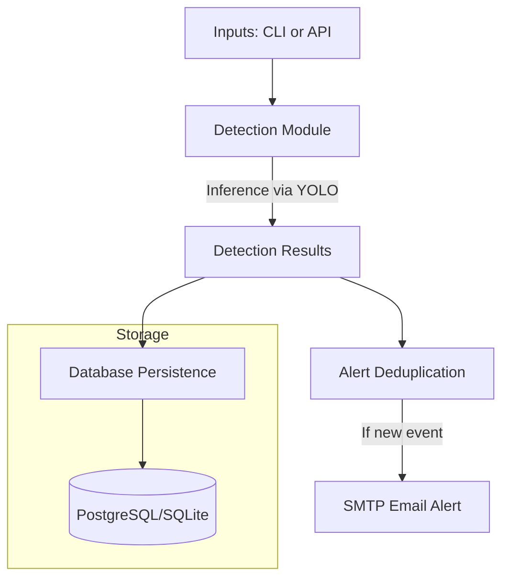

# Disaster Response Vision

Disaster Response Vision is an object detection and alerting pipeline that processes drone and UAV imagery to identify people and animals in disaster zones. The system accepts images and videos via a REST API or CLI, runs inference using COCO-pretrained YOLO models, stores detection metadata in a relational database, and dispatches email alerts when life signs are detected.

[](https://www.python.org/downloads/)
[](https://opensource.org/licenses/MIT)

## Overview

During search-and-rescue operations, operators must quickly triage hours of aerial footage to locate survivors. This system automates the detection phase by processing media feeds and flagging frames that contain life signs (people or animals). It is a structural pipeline for inference, deduplication, and alerting, and it does not attempt to solve domain-specific model training or aerial image stitching.

## Architecture



The architecture separates inference from side effects. The detection module evaluates media purely for bounding boxes and class labels, returning structured data. The persistence and alerting layers consume this structured data independently, ensuring that database timeouts or SMTP failures do not interrupt the core video processing loop.

## Pipeline Walkthrough

When media is submitted for processing (e.g., via the `/detect/image` API route or `disaster-vision detect` command):
1. **Ingestion**: The file is saved to a temporary directory.
2. **Inference**: The `Detector` class loads the specified YOLO model weights and runs a forward pass over the image (or frame-by-frame via `VideoProcessor`).
3. **Filtering**: The raw tensor outputs are parsed into `Detection` dataclasses. If the `life_only` flag is true, bounding boxes for inanimate objects are discarded.
4. **Persistence**: The `DetectionRepository` records the media filename and all bounding boxes into the SQLAlchemy database.
5. **Deduplication**: The `AlertDeduplicator` computes a SHA-256 hash of the detected classes and source file. If an identical hash was processed within the configured time window, the event is suppressed.
6. **Dispatch**: If the event is unique and contains life signs, the `EmailAlerter` formats an HTML message and dispatches it asynchronously via SMTP.

## Component Reference

- **Detection (`src/disaster_vision/detection/`)**: Encapsulates the Ultralytics YOLO library. `Detector` handles image inference and bounding box extraction. `VideoProcessor` manages frame extraction and looping without accumulating memory.
- **Alerts (`src/disaster_vision/alerts/`)**: Manages external notifications. `EmailAlerter` formats and sends HTML emails. `AlertDeduplicator` maintains an in-memory hash map to suppress rapid, repeated alerts for the same event.
- **Database (`src/disaster_vision/db/`)**: Handles relational storage using SQLAlchemy. `DetectionRepository` provides the Unit of Work for inserting media records and bulk-inserting bounding boxes.
- **API (`src/disaster_vision/api/`)**: Exposes the system over HTTP using FastAPI. `main.py` defines the routes, dependency injection for database sessions, and background task management for non-blocking email dispatch.
- **Evaluation (`src/disaster_vision/evaluation/`)**: Contains benchmarking scripts to measure mAP and CPU/GPU inference latency against standard datasets.

## Project Structure

```text
disaster-response-vision/
├── data/                  # Local volume for uploaded media and SQLite DB
├── evaluation/            # Benchmark outputs and charts
├── runs/                  # YOLO inference logs and annotated images
├── scripts/               # Utilities for downloading weights and datasets
├── src/
│   └── disaster_vision/
│       ├── alerts/        # Email dispatch and deduplication logic
│       ├── api/           # FastAPI routes and Pydantic schemas
│       ├── db/            # SQLAlchemy models, migrations, and repository
│       ├── detection/     # YOLO wrappers for images and video
│       ├── cli.py         # Typer command-line interface
│       └── config.py      # Pydantic settings and environment variables
├── tests/                 # Pytest suite for detection, repository, and deduplication
├── docker-compose.yml     # Multi-container orchestration (API + PostgreSQL)
└── pyproject.toml         # Build system and dependencies
```

## Getting Started

### Option A: Docker Compose (Recommended)
```bash
cp .env.example .env
# Edit .env with your SMTP credentials
docker compose up --build
```
This starts the FastAPI server on `http://localhost:8000` and a PostgreSQL database on port 5432. The database schema is created automatically on startup.

### Option B: Local Python
```bash
python -m venv .venv
source .venv/bin/activate  # On Windows: .\.venv\Scripts\Activate.ps1
pip install -e ".[postgres]"
cp .env.example .env
```
Start the API:
```bash
disaster-vision-api
```
Run a detection via CLI:
```bash
disaster-vision detect /path/to/image.jpg --life-only
```

## CLI Reference

- `detect`: Process an image, video, or directory. 
  Example: `disaster-vision detect ./footage/ --model yolov8n --life-only --no-alert`
- `alert-test`: Send a test email using the configured SMTP credentials.
  Example: `disaster-vision alert-test`
- `legacy-menu`: Launch the interactive terminal menu.
  Example: `disaster-vision legacy-menu`

## API Reference

- `GET /health`
  - Purpose: Returns API status and version.
  - Example Response: `{"status": "ok", "version": "0.3.0"}`
- `GET /detections`
  - Purpose: Lists recent detection records from the database.
  - Example Response: `{"count": 1, "items": [{"id": 1, "media_id": 1, "class_name": "person", "confidence": 0.88, "timestamp": "2026-08-08T12:00:00"}]}`
- `POST /detect/image`
  - Purpose: Run detection on an uploaded image. Accepts `model`, `life_only`, `send_alert`, and `persist` form fields.
  - Example Response: `{"source": "img.jpg", "model": "yolov8n", "life_detected": true, "alert_sent": true, "detections": [{"class_name": "person", "confidence": 0.91, "bbox": {"x1": 10.0, "y1": 20.0, "x2": 50.0, "y2": 100.0}}]}`
- `POST /detect/video`
  - Purpose: Run detection on an uploaded video synchronously. Accepts the same arguments and returns the same structure as `/detect/image`.

## Configuration Reference

| Variable | Default | Purpose |
|----------|---------|---------|
| `LOG_LEVEL` | `INFO` | Standard Python logging level. |
| `WEIGHTS_DIR` | `weights` | Directory to store YOLO `.pt` files. |
| `DATA_DIR` | `data` | Directory for uploaded media and SQLite DB. |
| `DEFAULT_MODEL` | `yolov8n` | Model name to use if unspecified in requests. |
| `CONFIDENCE_THRESHOLD` | `0.25` | Minimum confidence score to register a detection. |
| `DATABASE_URL` | `sqlite:///./data/disaster_vision.db` | SQLAlchemy connection string. |
| `SMTP_HOST` | `smtp.gmail.com` | SMTP server address for alerts. |
| `SMTP_PORT` | `587` | SMTP server port. |
| `SMTP_USER` | `""` | SMTP authentication username. |
| `SMTP_PASSWORD`| `""` | SMTP authentication password. |
| `ALERT_FROM` | `""` | Sender address for alert emails. |
| `ALERT_TO` | `""` | Recipient address for alert emails. |
| `ALERT_DEDUP_SECONDS`| `300` | Time window to suppress duplicate alerts. |

## Evaluation Methodology and Results

The benchmark evaluates the system against a genuinely held-out subset of the MS COCO val2017 dataset. A programmatic script samples 300 images directly from the official val2017 URLs to construct the `coco_val_subset.yaml` dataset. This strict separation guarantees zero overlap with the images the YOLO models saw during pre-training, providing an unbiased measure of generalization.

*Hardware: 11th Gen Intel Core i5-11300H @ 3.10GHz*
*Dataset: Ultralytics COCO val2017 (300-image held-out subset)*

| Model | mAP@0.5 | mAP@0.5:0.95 | Precision | Recall | Size (MB) | CPU Latency (ms) |
|-------|---------|--------------|-----------|--------|-----------|------------------|
| **yolov5s.pt** | 0.6349 | 0.4696 | 0.7483 | 0.5348 | 17.72 | 117.45 |
| **yolov8n.pt** | 0.5728 | 0.4120 | 0.6560 | 0.4846 | 6.25 | 83.68 |

## Known Limitations

- **Pre-trained Weights Only**: The models use weights trained strictly on standard COCO images. No domain-specific fine-tuning has been performed. At standard confidence thresholds, the current pre-trained models capture roughly 48% to 53% of actual life-sign instances. Fine-tuning on datasets like AIDER or VisDrone is required to achieve operational recall in aerial rubble environments.
- **In-Memory Deduplication**: The `AlertDeduplicator` state is stored in Python memory (RAM). If the FastAPI server restarts, or if the system scales to multiple instances behind a load balancer, deduplication state is not shared. Backing this component with Redis is required for multi-instance deployments.
- **Synchronous Video API**: The `/detect/video` endpoint processes the video entirely before returning a JSON response. Large video files trigger HTTP timeouts. Implementing WebSockets or Server-Sent Events (SSE) is required to stream detection results in real-time.

## Testing and CI

The test suite utilizes `pytest` to verify the isolation and correctness of core modules. It includes:
- Unit tests for `Detector` parsing logic using mocked YOLO responses.
- Unit tests for `AlertDeduplicator` verifying time-window suppression logic.
- Integration tests for `DetectionRepository` utilizing an in-memory SQLite database to verify SQLAlchemy insertion and querying.

Tests are executed locally via `python -m pytest tests/`. A GitHub Actions CI pipeline runs `ruff` for linting, `mypy` for static type checking, and the test suite across Python 3.10, 3.11, and 3.12 on every push to the repository.

## Security

Configuration is managed entirely through environment variables. No credentials, database URIs, or API keys are committed to the repository. Users must supply their own secrets by creating a `.env` file locally or configuring secrets in their deployment environment (see `docs/SCRUB_GIT_HISTORY.md` for the repository's git-history remediation methodology).

## Tech Stack

| Dependency | Purpose |
|------------|---------|
| `fastapi` / `uvicorn` | REST API framework and ASGI server. |
| `ultralytics` | YOLO object detection models. |
| `opencv-python` | Image and video frame manipulation. |
| `sqlalchemy` / `alembic` | Database ORM and migration management. |
| `typer` | Command-line interface framework. |
| `aiosmtplib` | Asynchronous SMTP email dispatch. |
| `pydantic` / `pydantic-settings` | Schema validation and environment config loading. |
| `torch` | Tensor operations backing the Ultralytics models. |

## License

This project is licensed under the MIT License.